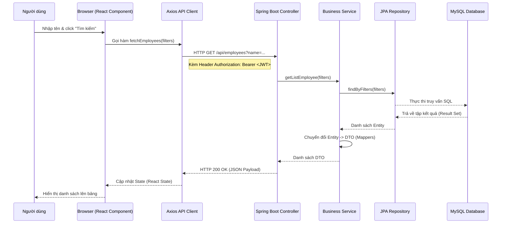

# Cấu Trúc Hệ Thống & Luồng Xử Lý Dữ Liệu

Tài liệu này phân tích cấu trúc thư mục và luồng hoạt động của dự án từ giao diện người dùng đến cơ sở dữ liệu.

---

## 1. Tổng Quan Kiến Trúc
Dự án được xây dựng theo mô hình **Client-Server** tách biệt:
- **Frontend**: Next.js (React Framework) - Đảm nhận giao diện và logic phía client.
- **Backend**: Spring Boot (Java) - Đảm nhận xử lý nghiệp vụ, bảo mật và tương tác DB.
- **Database**: MySQL - Lưu trữ dữ liệu hệ thống.

---

## 2. Cấu Trúc Thư Mục Dự Án

### 2.1 Backend (`/Backend`)
Dự án Backend tuân thủ cấu trúc phân lớp tiêu chuẩn của Spring Boot:
- `src/main/java/com/luvina/la/`
    - `controller/`: Chứa các REST Controllers định nghĩa các API Endpoints (ví dụ: `EmployeeController`, `AuthController`).
    - `service/`: Chứa logic nghiệp vụ xử lý dữ liệu.
    - `repository/`: Chứa các interface kế thừa JpaRepository để tương tác với cơ sở dữ liệu.
    - `entity/`: Các lớp ánh xạ trực tiếp với bảng trong DB.
    - `dto/` & `payload/`: Các đối tượng vận chuyển dữ liệu giữa các lớp và trả về cho app.
    - `config/`: Cấu hình hệ thống (Security, Database, Web context).
    - `mapper/`: Sử dụng MapStruct để chuyển đổi giữa Entity và DTO.
- `src/main/resources/`
    - `config/`: Chứa các file `application.yaml` để cấu hình môi trường (dev, prod).
    - `db/migration/`: Chứa các file SQL của **Flyway** để quản lý phiên bản cơ sở dữ liệu.

### 2.2 Frontend (`/Frontend`)
Dự án Frontend sử dụng Next.js với **App Router**:
- `app/`: Chứa cấu trúc các trang (Routing).
    - `(auth)/`: Các trang liên quan đến xác thực (Login, Logout).
    - `(protected)/`: Các trang yêu cầu đăng nhập mới được truy cập (Quản lý nhân viên).
- `components/`: Chứa các UI Components dùng chung (Table, Form, Pagination).
- `hooks/`: Chứa các custom hooks để xử lý logic API (ví dụ: `useEmployeeApi`).
- `lib/api/`: Cấu hình Axios client (`client.ts`) để gọi lên Backend.
- `types/`: Định nghĩa các interface TypeScript cho dữ liệu.

---

## 3. Luồng Xử Lý Dữ Liệu (Data Flow)

Luồng xử lý điển hình khi người dùng thực hiện một hành động (ví dụ: Tìm kiếm nhân viên):

---

## 4. Bảo Mật & Xác Thực
Hệ thống sử dụng cơ chế **JWT (JSON Web Token)**:
1. **Đăng nhập**: Người dùng gửi thông tin tới `/api/login`. Backend kiểm tra và trả về `access_token`.
2. **Lưu trữ**: Frontend lưu token vào `sessionStorage`.
3. **Giao tiếp**: Mọi request API sau đó đều được Axios Interceptor tự động thêm vào Header `Authorization`.
4. **Kiểm tra**: Backend Security Filter giải mã token để xác thực quyền truy cập của người dùng.

---

## 5. Công Nghệ Sử Dụng (Tech Stack)
| Thành phần | Công nghệ |
| :--- | :--- |
| **Giao diện** | React, Next.js, TypeScript |
| **Styling** | Vanilla CSS / CSS Modules |
| **Logic Server** | Java 17, Spring Boot 2.7.x |
| **Truy vấn dữ liệu** | Spring Data JPA, Hibernate |
| **Quản lý DB** | Flyway, MySQL |
| **Bảo mật** | Spring Security, JWT (java-jwt) |
| **Công cụ tiện ích** | Lombok, MapStruct, Axios |
