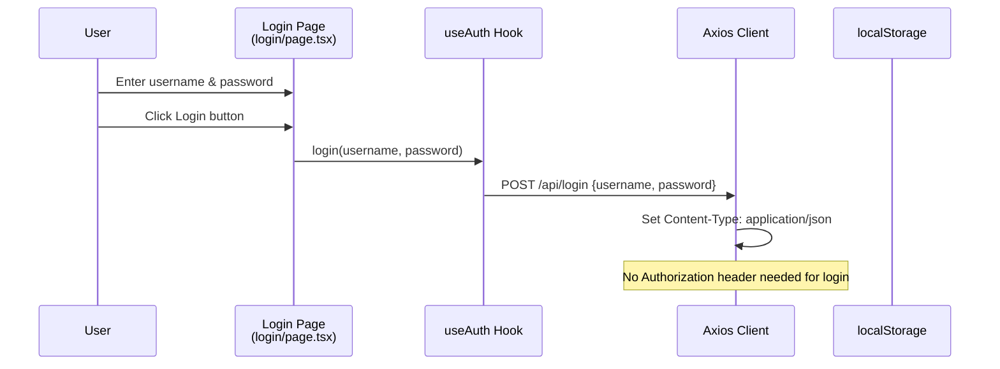
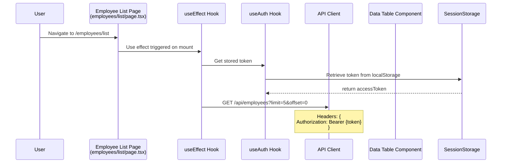
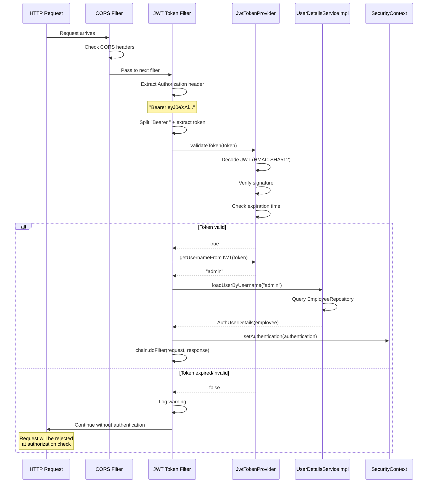

# Sequence Diagram: Employee List Flow (Frontend & Backend)

## Overall Architecture Flow

```mermaid
sequenceDiagram
    actor User
    participant FE as Frontend<br/>(Next.js)
    participant HTTP as HTTP Client<br/>(Axios)
    participant JwtFilter as JWT Filter
    participant Controller as EmployeeController
    participant Service as EmployeeService
    participant Repository as EmployeeRepository
    participant DB as MySQL Database

    User->>FE: Truy cập trang danh sách
    FE->>FE: Load stored token từ localStorage
    FE->>HTTP: GET /api/employees?limit=5&offset=0
    Note over HTTP: Header: Authorization: Bearer {token}

    HTTP->>JwtFilter: Request + JWT token
    JwtFilter->>JwtFilter: Validate token signature
    JwtFilter->>JwtFilter: Check token expiration
    alt Token valid
        JwtFilter->>JwtFilter: Extract employee info từ token
        JwtFilter->>JwtFilter: Set SecurityContext
        JwtFilter->>Controller: Chain filter - tiếp tục request
    else Token invalid/expired
        JwtFilter-->>HTTP: 401 Unauthorized
        HTTP-->>FE: Error response
        FE->>FE: Redirect to login page
    end

    Controller->>Controller: Parse query params (limit, offset, name, deptId)
    Controller->>Service: getEmployeeList(employeeName, departmentId, limit, offset)
    Service->>Repository: getEmployeeList() - native SQL query
    
    Repository->>DB: SELECT e.employee_id, e.employee_name, ...<br/>FROM employees INNER JOIN departments<br/>LEFT JOIN employees_certifications<br/>LEFT JOIN certifications<br/>WHERE role IS NULL OR role = 0<br/>LIMIT 5 OFFSET 0

    DB-->>Repository: List<Object[]> - 5 rows raw data
    Note over Repository: row[0]=employeeId, row[1]=employeeName,<br/>row[2]=birthDate(java.sql.Date),<br/>row[3]=departmentName, ..., row[8]=score

    Repository->>Service: countNonAdminEmployees()
    Repository->>DB: SELECT COUNT(*) WHERE role IS NULL OR role = 0
    DB-->>Repository: Long totalRecords = 20

    Service->>Service: Stream convert Object[] to EmployeeDTO
    Note over Service: convertSqlDateToLocalDate(row[2])<br/>→ java.time.LocalDate conversion
    Service->>Service: Build List<EmployeeDTO> (5 items)
    
    Service-->>Controller: List<EmployeeDTO> employees
    Controller->>Controller: Create EmployeeListResponse<br/>code=200, totalRecords=20, employees=[...]
    Controller-->>HTTP: JSON Response

    HTTP-->>FE: {<br/>&nbsp;&nbsp;"code": 200,<br/>&nbsp;&nbsp;"totalRecords": 20,<br/>&nbsp;&nbsp;"employees": [<br/>&nbsp;&nbsp;&nbsp;&nbsp;{<br/>&nbsp;&nbsp;&nbsp;&nbsp;&nbsp;&nbsp;"employeeId": 5,<br/>&nbsp;&nbsp;&nbsp;&nbsp;&nbsp;&nbsp;"employeeName": "Nguyễn Thị Mai Hương",<br/>&nbsp;&nbsp;&nbsp;&nbsp;&nbsp;&nbsp;"departmentName": "Phòng IT",<br/>&nbsp;&nbsp;&nbsp;&nbsp;&nbsp;&nbsp;"certificationName": "Cấp 4",<br/>&nbsp;&nbsp;&nbsp;&nbsp;&nbsp;&nbsp;"endDate": "2025-01-14",<br/>&nbsp;&nbsp;&nbsp;&nbsp;&nbsp;&nbsp;"score": 290.0<br/>&nbsp;&nbsp;&nbsp;&nbsp;},<br/>&nbsp;&nbsp;&nbsp;&nbsp;...<br/>&nbsp;&nbsp;]<br/>}

    FE->>FE: Parse response JSON
    FE->>FE: Render employee table<br/>- 5 records/page<br/>- Total 20 employees
    FE-->>User: Display employee list with pagination
```

---

## Luồng Chi Tiết

### 1. **Frontend (Next.js) - Login & Token Storage**


### 2. **Frontend (Next.js) - Employee List Page**


### 3. **Backend - JWT Validation Flow**


### 4. **Backend - Controller & Service Flow**
```mermaid
sequenceDiagram
    participant Controller as EmployeeController
    participant Service as EmployeeServiceImpl
    participant Repository as EmployeeRepository
    participant Database as MySQL

    Controller->>Controller: Receive GET /api/employees?limit=5&offset=0
    Controller->>Controller: Parse @RequestParam annotations
    Note over Controller: employeeName="", departmentId=null,<br/>limit=5, offset=0
    
    Controller->>Service: countNonAdminEmployees()
    Service->>Repository: countNonAdminEmployees()
    Repository->>Database: COUNT(*) FROM employees WHERE role IS NULL OR role = 0
    Database-->>Repository: 20 (total employees)
    Repository-->>Service: Long 20
    Service-->>Controller: Long 20

    Controller->>Service: getEmployeeList(null, null, 5, 0)
    Service->>Repository: getEmployeeList(null, null, 5, 0)
    
    Repository->>Database: Complex JOIN query
    Note over Database: SELECT e.employee_id, e.employee_name, <br/>e.employee_birth_date, d.department_name,<br/>e.employee_email, e.employee_telephone,<br/>c.certification_name, ec.end_date, ec.score<br/>FROM employees e<br/>INNER JOIN departments d<br/>LEFT JOIN employees_certifications ec<br/>LEFT JOIN certifications c<br/>WHERE (e.role IS NULL OR e.role = 0)<br/>AND (...filters...)<br/>ORDER BY e.employee_id, ec.end_date DESC<br/>LIMIT 5 OFFSET 0
    
    Database-->>Repository: List<Object[]> (5 rows)
    Note over Repository: [<br/>[5, "Nguyễn Thị Mai Hương", java.sql.Date(1983-07-08),<br/>&nbsp;"Phòng IT", "ntmhuong@luvina.net",<br/>&nbsp;"0914326386", "Cấp 4", java.sql.Date(2025-01-14), 290.0],<br/>[6, "Lê Thị Xoa", java.sql.Date(1983-06-15),<br/>&nbsp;"Phòng QAT", "xoalt@luvina.net",<br/>&nbsp;"0914326387", "Cấp 4", java.sql.Date(2025-03-19), 280.0],<br/>...<br/>]

    Repository-->>Service: List<Object[]>
    Service->>Service: Stream map each Object[] row
    Note over Service: forEach row:<br/>- Convert row[2] java.sql.Date → LocalDate<br/>- Convert row[7] java.sql.Date → LocalDate<br/>- Create EmployeeDTO(id, name, birthDate,<br/>&nbsp;&nbsp;deptName, email, phone, cert, endDate, score)<br/>- Collect to List<EmployeeDTO>
    
    Service-->>Controller: List<EmployeeDTO> (5 items)
    
    Controller->>Controller: Create EmployeeListResponse
    Note over Controller: response=new EmployeeListResponse()<br/>response.setCode(200)<br/>response.setTotalRecords(20)<br/>response.setEmployees(employees)
    
    Controller-->>HTTP: JSON Response
```

---

## Database Query Details

### Native SQL Query:
```sql
SELECT 
    e.employee_id,              /* [0] */
    e.employee_name,            /* [1] */
    e.employee_birth_date,      /* [2] java.sql.Date */
    d.department_name,          /* [3] */
    e.employee_email,           /* [4] */
    e.employee_telephone,       /* [5] */
    c.certification_name,       /* [6] */
    ec.end_date,                /* [7] java.sql.Date */
    ec.score                    /* [8] */
FROM employees e
    INNER JOIN departments d ON e.department_id = d.department_id
    LEFT JOIN employees_certifications ec ON e.employee_id = ec.employee_id
    LEFT JOIN certifications c ON ec.certification_id = c.certification_id
WHERE 
    (e.role IS NULL OR e.role = 0)          /* Exclude admins */
    AND (e.employee_name LIKE CONCAT('%', ?, '%') OR ? = '' OR ? IS NULL)
    AND (e.department_id = ? OR ? IS NULL)
ORDER BY 
    e.employee_id ASC,
    ec.end_date DESC
LIMIT 5 OFFSET 0
```

---

## Key Data Transformations

### 1. SQL Result → Object[] (Raw Array)
```
[java.lang.Long(5), "Nguyễn Thị Mai Hương", java.sql.Date(1983-07-08), 
 "Phòng IT", "ntmhuong@luvina.net", "0914326386", "Cấp 4", 
 java.sql.Date(2025-01-14), java.math.BigDecimal(290.0)]
```

### 2. Object[] → EmployeeDTO (Using Helper Method)
```java
new EmployeeDTO(
    ((Number) row[0]).longValue(),                    // 5
    (String) row[1],                                   // "Nguyễn Thị Mai Hương"
    convertSqlDateToLocalDate(row[2]),                // LocalDate(1983-07-08)
    (String) row[3],                                   // "Phòng IT"
    (String) row[4],                                   // "ntmhuong@luvina.net"
    (String) row[5],                                   // "0914326386"
    (String) row[6],                                   // "Cấp 4"
    convertSqlDateToLocalDate(row[7]),                // LocalDate(2025-01-14)
    row[8] != null ? ((Number) row[8]).doubleValue() : null  // 290.0
)
```

### 3. EmployeeDTO → JSON Response
```json
{
  "code": 200,
  "totalRecords": 20,
  "employees": [
    {
      "employeeId": 5,
      "employeeName": "Nguyễn Thị Mai Hương",
      "employeeBirthDate": "1983-07-08",
      "departmentName": "Phòng IT",
      "employeeEmail": "ntmhuong@luvina.net",
      "employeeTelephone": "0914326386",
      "employeeLoginId": null,
      "employeeLoginPassword": null,
      "certificationName": "Cấp 4",
      "endDate": "2025-01-14",
      "score": 290.0
    },
    ...
  ]
}
```

---

## Error Handling

### 1. **JWT Token Valid → 200 OK**
- Token signature verified ✅
- Token not expired ✅
- Employee data returned ✅

### 2. **JWT Token Invalid → 401 Unauthorized**
- Invalid signature → JwtTokenFilter logs warning
- Token expired → JwtTokenFilter logs warning
- No header → Passed without auth

### 3. **Data Conversion Error ✅ FIXED**
- **Before**: `ClassCastException: java.sql.Date cannot be cast to java.time.LocalDate`
- **After**: Use `convertSqlDateToLocalDate()` helper method
  ```java
  private LocalDate convertSqlDateToLocalDate(Object obj) {
      if (obj == null) return null;
      if (obj instanceof Date) {
          return ((Date) obj).toLocalDate();  // ✅ Proper conversion
      }
      return null;
  }
  ```

---

## Performance Considerations

### Database Side:
- **Native SQL**: Direct SQL execution → Better performance than ORM
- **Indexes**: employee_id (PK), department_id (FK) automatically indexed
- **JOINs**: INNER JOIN departments (fast), LEFT JOINs on certifications (O(n))
- **Pagination**: LIMIT 5 OFFSET 0 → Only 5 records fetched

### Application Side:
- **Stream Processing**: Single pass through data with map/collect
- **Date Conversion**: O(1) per row (instantaneous)
- **Response Building**: One-time wrapper creation

### Frontend Side:
- **Token Caching**: Stored in localStorage → No re-login needed
- **Axios Interceptor**: Automatic Authorization header attachment
- **Client-side Pagination**: Can handle 20-record dataset easily

---

## Summary

**Complete Flow:**
1. ✅ Frontend gets stored JWT token
2. ✅ Frontend sends GET /api/employees with JWT in Authorization header
3. ✅ JwtTokenFilter validates token signature & expiration
4. ✅ EmployeeController receives request, delegates to EmployeeService
5. ✅ EmployeeService calls EmployeeRepository.getEmployeeList()
6. ✅ Repository executes native SQL with 4-table JOIN
7. ✅ MySQL returns List<Object[]> with java.sql.Date objects
8. ✅ Service converts Object[] → EmployeeDTO (with date conversion)
9. ✅ Controller wraps in EmployeeListResponse JSON
10. ✅ Frontend receives JSON with 20 total records, 5 per page
11. ✅ Frontend renders employee table with pagination

**Status**: ✅ **FULLY OPERATIONAL**
